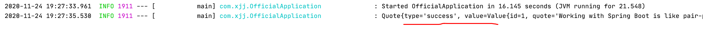

# Spring官方

https://spring.io/guides

## Guides

### 1. Building a RESTful

```java
@RestController
public class GreetingController {

    private static final String template = "Hello, %s!";
    // 原子性，同步的Long
    private final AtomicLong counter = new AtomicLong();

    @GetMapping("/greeting")
    public Greeting greeting(@RequestParam(value = "name", defaultValue = "World") String name) {
        return new Greeting(counter.incrementAndGet(), String.format(template, name));
    }
}

@SpringBootApplication  // 启动配置，无bean.xml
@RestController         // rest服务
public class OfficialApplication {

    public static void main(String[] args) {
      	/*无bean.xml--Spring的*/
        SpringApplication.run(OfficialApplication.class, args);
    }
}
```

- `@GetMapping`,`@PostMapping`映射方法Get,POST；可以用`@RequestMapping(method=GET)`代替
  - `@RequestParam`：绑定参数；可默认值`defaultValue = ""`
- Jackson 2：json
  - Spring http消息转换**默认支持对象实例转json**
  - 传统MVC控制器和`Restful Web`服务控制器之间的一个关键区别是**HTTP响应主体的创建方式**。`Restful Web`服务控制器填充并返回一个`Greeting`对象，而不是依赖于视图技术来执行问候数据到HTML的服务器端呈现。**对象数据将作为JSON直接写入HTTP响应。**
- `@RestController`
  -  `@Controller` 和 `@ResponseBody`的简写
  -  它将**类标记为控制器**，其中每个方法都**返回域对象**而不是视图。
- `@SpringBootApplication`：启动类注解，自动添加如下注解`autoconfigure`
  - `@Configuration`：将类对象标记为Bean源
  - `@EnableAutoConfiguration`：使Spring boot 添加在classpath下的beans 
  - `@ComponentScan`：使Spring去找classpath下的`components, configurations, and services`
- restful
  - https://blog.csdn.net/kebi007/article/details/102927209

### 2. 后台定时任务

**Scheduling Tasks**

1. [Awaitility](http://www.awaitility.org/) ：专门针对异步方法的测试

2. ```java
   /**
    * @Author LJ
    * @Date 2020/11/24
    * msg 定时任务，后台异步任务
    */
   
   @Component      // 标记bean注入
   @EnableScheduling       // 定时任务,Enables Spring's scheduled task execution capability
   public class ScheduledTasks {
       private static final Logger log = LoggerFactory.getLogger(ScheduledTasks.class);
   
       private static final SimpleDateFormat dateFormat = new SimpleDateFormat("HH:mm:ss");
   
       @Scheduled(fixedRate = 5000)		// Annotation that marks a method to be scheduled
       public void reportCurrentTime() {
           log.info("当前时间为：{}", dateFormat.format(new Date()));
       }
   }
   
   
   @SpringBootApplication  // 启动配置
   public class OfficialApplication {
       public static void main(String[] args) {
           SpringApplication.run(OfficialApplication.class, args);
       }
   }
   ```

- `@EnableScheduling`：创建后台任务执行器，启用Spring的计划任务执行功能 
  - `@Scheduled(fixedRate = 5000)`	:标记要调度的方法的注释 

3. 注解分类

   - @controller：  controller控制器层（注入服务）
   - @service ：   service服务层（注入dao）
   - @repository ： dao持久层（实现dao访问）
   - @component： **标注一个类为Spring容器的Bean**，（把普通pojo实例化到spring容器中，相当于配置文件中的< bean id="" class=""/>）

### 3. 请求Rest服务

**Consuming a RESTful Web Service**

1. Rest 随机生成字符串API：json

   https://gturnquist-quoters.cfapps.io/api/random

```java
import com.fasterxml.jackson.annotation.JsonIgnoreProperties;

/**
 * @Author LJ
 * @Date 2020/11/24
 * msg 映射类，自定义类型
 */

@JsonIgnoreProperties(ignoreUnknown = true)
public class Quote {
    private String type;
    private Value value;
  	/* 省略get,set*/
}


@JsonIgnoreProperties(ignoreUnknown = true)
public class Value {
    private long id;
    private String quote;
  	/* 省略get,set*/
}


@Component		// 作bean
public class ConsumeRest {

    private static final Logger log = LoggerFactory.getLogger(OfficialApplication.class);

    @Bean		// 注入RestTemplate
    public RestTemplate restTemplate(RestTemplateBuilder builder) {
        return builder.build();
    }

    @Bean
    public CommandLineRunner run(RestTemplate restTemplate) throws Exception {
        // lambda
        return args -> {
            Quote quote = restTemplate.getForObject("https://gturnquist-quoters.cfapps.io/api/random",
                    Quote.class);
            log.info(quote.toString());
        };
    }
}
```



1. 请求Rest服务

   1.  Spring提供了一个方便的模板类`ResTemplate`。`ResTemplate`使与大多数RESTful服务【Json交互】的交互成为简单。可以将这些数据绑定到**自定义域类型**。 

2. 代码分析

   - `CommandLineRunner`

     - 该**函数式接口**主要用于实现在**应用初始化后**，去**执行一段代码**块逻辑，这段初始化代码在整个应用生命周期内**只会执行一次**。

       ```java
       @FunctionalInterface
       public interface CommandLineRunner {
       	void run(String... args) throws Exception;
       }
       ```

       

### 4. jdbc-H2

#### 依赖

```xml
<!-- jdbc       -->
<dependency>
  <groupId>org.springframework.boot</groupId>
  <artifactId>spring-boot-starter-data-jdbc</artifactId>
</dependency>
```

#### 代码

```java
package com.xjj.e_04_database;

public class Customer {
    private long id;
    private String first_name;
    private String last_name;

    public Customer(long id, String first_name, String last_name) {
        this.id = id;
        this.first_name = first_name;
        this.last_name = last_name;
    }
    // 省略get/ set
}


/**
 * @Author LJ
 * @Date 2020/11/25
 * msg 使用Jdbc连接数据库，H2 database[基于内存的数据库]
 */

@Component("h2Database")		// 组件--bean
public class RelationalDataAccess implements CommandLineRunner {
    private static final Logger log = LoggerFactory.getLogger(RelationalDataAccess.class);

    @Autowired	// 域自动注入
    JdbcTemplate jdbcTemplate;

    @Override   // Spring boot 初始化之后调用
    public void run(String... args) throws Exception {
        log.info("创建表");

        jdbcTemplate.execute("DROP TABLE customers IF EXISTS");
        jdbcTemplate.execute("CREATE TABLE customers(" +
                "id SERIAL, first_name VARCHAR(255), last_name VARCHAR(255))");

        List<Object[]> splitUpNames = Arrays.asList("John Woo", "Jeff Dean").stream()
                .map(name -> name.split(" ")).collect(Collectors.toList());

        // 批量插入
        jdbcTemplate.batchUpdate("INSERT INTO customers(first_name, last_name) VALUES (?,?)", splitUpNames);

      	// RowMapper (ResultSet, int) -> T
        jdbcTemplate.query(
                "SELECT id, first_name, last_name FROM customers WHERE first_name = ?", new Object[] { "John" },
                (rs, rowNum) -> new Customer(rs.getLong("id"), rs.getString("first_name"), rs.getString("last_name"))	// 函数式接口
        ).forEach(customer -> log.info(customer.toString()));
    }
}
```


#### 分析

- springboot支持H2（内存中的关系数据库引擎）并**自动创建连接**
- `@Autowired`：所以springboot会**自动创建**一个`JdbcTemplate`。**自动加载**
- `?`：避免SQL注入攻击
- `RowMapper`：映射结果集

#### H2

- 内存中的关系数据库引擎

  

### 5. mysql

1. pom.xml

   ```xml
   <dependency>
     <groupId>mysql</groupId>
     <artifactId>mysql-connector-java</artifactId>
     <scope>runtime</scope>
   </dependency>
   ```

2. springboot**默认数据库**是H2。当使用任何其他数据库时，必须配置`src/main/resources/application.properties`属性文件。

   ```properties
   spring.datasource.url=jdbc:mysql://localhost:3306/spring?characterEncoding=utf-8&useSSL=true&serverTimezone=GMT
   spring.datasource.username=root
   spring.datasource.password=
   spring.datasource.driverClassName=com.mysql.cj.jdbc.Driver
   ```

### 6. Uploading Files

**接收HTTP多文件上传**


### 7. MVC

**与thymeleaf整合**

1. pom.xml

   ```xml
   <!-- thymeleaf: spring HTML-->
   <dependency>
     <groupId>org.springframework.boot</groupId>
     <artifactId>spring-boot-starter-thymeleaf</artifactId>
   </dependency>
   ```

2. Model装配，View【thymeleaf】解析

```java
@Controller
public class GreetingController {
    @GetMapping("/greeting")
    public String greeting(@RequestParam(name="name", required=false, defaultValue="World") String name, Model model) {
        model.addAttribute("name", name);
        return "greeting";
    }
}
```

`src/main/resources/templates/greeting.html`

```html
<!DOCTYPE HTML>
<html xmlns:th="http://www.thymeleaf.org">
<head>
  <title>MVC</title>
  <meta http-equiv="Content-Type" content="text/html; charset=UTF-8" />
</head>
<body>
<p th:text="'Hello, ' + ${name} + '!'" />
</body>
</html>
```

#### Spring Boot Devtools

```xml
<dependency>
  <groupId>org.springframework.boot</groupId>
  <artifactId>spring-boot-devtools</artifactId>
  <scope>runtime</scope>
  <optional>true</optional>
</dependency>
```

为了加快刷新周期，Spring boot提供了一个称为`spring-boot-devtools`的便捷模块

- 启用热交换。
- 将模板引擎切换为禁用缓存。
- 使LiveReload能够自动刷新浏览器。
- 其他基于开发而非生产环境的默认。
- https://www.jianshu.com/p/cdc00059eafe


### 8. Redis-message

**发布和订阅使用Redis发送的消息**

#### 1. Redis

- Remote Dictionary Server ，即远程字典服务

- 是一个高性能的key-value数据库

- NoSQL数据存储

- 消息传递系统

- Mac 安装启动

  - brew install redis

  - redis-server

    

#### 2. 使用技术

- Spring Data Redis：提供了使用Redis发送和接收消息所需的**所有组件**。需要
  - A connection factory：`RedisConnectionFactory` --让监听器和消息容器连接到Redis服务器。 
    - 连接工厂被注入到消息侦听器容器和Redis模板中 
  - A message listener container: `RedisMessageListenerContainer, MessageListenerAdapter`---订阅信息
  - A Redis template: `StringRedisTemplate` ---发布字符串信息

#### 3. 概述

- 基于消息传递的应用程序中，都有**消息发布者和消息接收方**
- 接收方：需要**注册作为监听者**

#### 4. 代码

1. 依赖

```xml
<!-- redis 依赖-->
<dependency>
  <groupId>org.springframework.boot</groupId>
  <artifactId>spring-boot-starter-data-redis</artifactId>
</dependency>
```

2. Spring Data Redis

   ```java
   // 接收器
   public class Receiver {
       //日志器
       private static final Logger log = LoggerFactory.getLogger(Receiver.class);
       // 计数器
       private AtomicInteger counter = new AtomicInteger();
   
       public void receiveMessage(String message) {
           log.info("收到消息：" + message);
           counter.incrementAndGet();
       }
       public int getCounter() {
           return counter.get();
       }
   }
   
   
   
   @Component
   public class MessagingRedis{
   
       private static final Logger log = LoggerFactory.getLogger(MessagingRedis.class);
   
       @Bean
       Receiver receiver() {
           return new Receiver();
       };
   
       // 容器 让监听器和消息容器连接到Redis服务器。
       @Bean
       RedisMessageListenerContainer container(RedisConnectionFactory factory,
                                               MessageListenerAdapter adapter) {
           RedisMessageListenerContainer container = new RedisMessageListenerContainer();
           container.setConnectionFactory(factory);
           // 监听 chat 管道的消息。
           container.addMessageListener(adapter, new PatternTopic("chat"));
   
           return container;
       }
   
       @Bean
       MessageListenerAdapter adapter(Receiver receiver) {
           // 注册监听器及监听方法
           return new MessageListenerAdapter(receiver, "receiveMessage");
       }
   
       @Bean
       StringRedisTemplate template(RedisConnectionFactory factory) {
           // 发送信息
           return new StringRedisTemplate(factory);
       }
   
       // Spring初始化完成启动
       @Bean
       CommandLineRunner initRedis() {
           return args -> {
               StringRedisTemplate template = BeanUtils.getBean(StringRedisTemplate.class);
               Receiver receiver = BeanUtils.getBean(Receiver.class);
   
               while (receiver.getCounter() <= 3) {
                   log.info("=====发送消息======");
                   // 发送到 chat 管道
                   template.convertAndSend("chat", "Hello from Redis!" +
                           receiver.getCounter());
                   Thread.sleep(500L);
               }
   //            System.exit(0);
           };
       }
   }
   ```

   

### 9. Validating Form Input

**MVC 接受用户输入并使用标准验证注释检查输入；并在屏幕上显示错误消息，以便用户可以重新输入使其有效。**

#### 1. 依赖

```xml
<!-- validation 依赖-->
<dependency>
  <groupId>org.springframework.boot</groupId>
  <artifactId>spring-boot-starter-validation</artifactId>
</dependency>
```

#### 2. javax.validation

- https://blog.csdn.net/qq_33655674/article/details/81509615


#### 3. 代码

```java
@Controller
public class ValidateController implements WebMvcConfigurer {

    // 参数是传给view的
    @GetMapping("/validate")
    public String showForm(Person person) {
        return "validation";
    }

  	// @Valid 验证参数
    @PostMapping("validate")
    public String checkPersonInfo(@Valid Person person, BindingResult result) {
        if (result.hasErrors())
            return "validation";
        return "redirect:/";
    }
}
```

```html
<form action="#" th:action="@{/validate}" th:object="${person}" method="post">
  <table>
    <tr>
      <td>Name:</td>
      <td><input type="text" th:field="*{name}" /></td>
      <td th:if="${#fields.hasErrors('name')}" th:errors="*{name}">Name Error</td>
    </tr>
    <tr>
      <td>Age:</td>
      <td><input type="text" th:field="*{age}" /></td>
      <td th:if="${#fields.hasErrors('age')}" th:errors="*{age}">Age Error</td>
    </tr>
    <tr>
      <td><button type="submit">Submit</button></td>
    </tr>
  </table>
</form>
```


### 10. Spring Boot Actuator

**对应用系统进行自省和监控的功能模块**，**健康检查、审计、统计和HTTP追踪等**

https://blog.csdn.net/pengjunlee/article/details/80235390

https://www.jianshu.com/p/d5943e303a1f

https://docs.spring.io/spring-boot/docs/current/reference/htmlsingle/#production-ready

#### 1. 依赖

```xml
<!-- actuator依赖 -->
<dependency>
  <groupId>org.springframework.boot</groupId>
  <artifactId>spring-boot-starter-actuator</artifactId>
</dependency>
```

#### 2. 相关配置

1. `src/main/resources/application.properties`

```properties
#server.port: 9000
management.server.port: 9001
management.server.address: 127.0.0.1
management.endpoints.web.exposure.include=*
```

#### 3. 测试

1. 运行测试

   http://localhost:9001/actuator

   

   

### 11. 批处理，文件输入

**创建基本批处理驱动解决方案的过程。**

#### 1. 


### 12. Spring Security

#### 1. 依赖

```xml
<!-- security -->
<dependency>
  <groupId>org.springframework.boot</groupId>
  <artifactId>spring-boot-starter-security</artifactId>
</dependency>
<dependency>
  <groupId>org.springframework.security</groupId>
  <artifactId>spring-security-test</artifactId>
  <scope>test</scope>
</dependency>
```

#### 2. 代码

```java
// MVC配置类
@Configuration
public class MvcConfig implements WebMvcConfigurer {
    @Override
    public void addViewControllers(ViewControllerRegistry registry) {
        // 不用写Controller，直接转templates --> view
        registry.addViewController("/hello").setViewName("hello");
        registry.addViewController("/login").setViewName("login");
    }
}
```

**SecurityConfig类**

```java
/**
 * @Author LJ
 * @Date 2020/11/27
 * msg Spring secure 安全配置类
 */

@Configuration
@EnableWebSecurity
public class WebSecurityConfig extends WebSecurityConfigurerAdapter {

  	// 定义哪些URL路径应该受到保护，哪些不应该 
    @Override
    protected void configure(HttpSecurity http) throws Exception {
        http.authorizeRequests()
                .antMatchers("/", "/index", "/validate").permitAll()     // 设置不用登录页
                .anyRequest().authenticated()
                .and()
                .formLogin()
                .loginPage("/login").permitAll()    // 其余页需要登录访问
                .and()
                .logout().permitAll();
    }

    @Bean
    @Override
    protected UserDetailsService userDetailsService() {
        // 设置权限允许信息
        UserDetails user = User.withDefaultPasswordEncoder()
                .username("user")
                .password("111111")
                .roles("USER")
                .build();
        return new InMemoryUserDetailsManager(user);
    }
}
```

#### 3. 分析

- `@EnableWebSecurity`： 启用Spring Security的web安全支持并提供SpringMVC集成。 
- 当用户成功登录时，它们将被**重定向到以前请求的需要身份验证的页面**。


### 13. 超文本链接

**Hypermedia-Driven**

#### 1. 相关技术

- Spring HATEOAS：Hypermedia as the engine of application state
  - https://blog.csdn.net/weixin_34290096/article/details/93415981


#### 2. 依赖

```xml
<!-- Hypermedia-Driven -->
<dependency>
  <groupId>org.springframework.boot</groupId>
  <artifactId>spring-boot-starter-hateoas</artifactId>
</dependency>
```

#### 3. 代码

```java
public class Greeting extends RepresentationModel<Greeting> {
    private final String content;

    @JsonCreator
    public Greeting(@JsonProperty("content") String content) {
        this.content = content;
    }

    public String getContent() {
        return content;
    }
}

// 静态导入 linkTo
import static org.springframework.hateoas.server.mvc.WebMvcLinkBuilder.*;

@RestController
public class GreetController {

    private static final String template = "Hello, %s!";
    // 原子性，同步的Long
    private final AtomicLong counter = new AtomicLong();

    @GetMapping("/hyper")
    public HttpEntity<Greeting> hyper(@RequestParam(value = "name", defaultValue = "World")
                                                  String name) {
        Greeting greeting = new Greeting(counter.incrementAndGet(), String.format(template, name));
        greeting.add(linkTo(methodOn(GreetController.class).hyper(name)).withSelfRel());

        return new ResponseEntity<>(greeting, HttpStatus.OK);
    }
}
```


#### 4. 分析

- `RepresentationModel`
  -  Spring hateoas附带了一个基类（称为RepresentationModel），它允许添加Link的实例，并确保它们的呈现 

- `@JsonCreator`:  标志着Jackson如何创建这个实例。 
- `@JsonProperty`:  标记Jackson应将此构造函数参数放入的字段。 


### 14. 异步Async

**异步查询。重点是异步部分，这是扩展服务时经常使用的特性。**

#### 1. 代码

```java
// 实体类
@JsonIgnoreProperties(ignoreUnknown=true)		// 忽略类中未列出的任何属性
public class User {

  private String name;
  private String blog;
}


// service类
@Service
public class GitHubLookupService {

  private static final Logger logger = LoggerFactory.getLogger(GitHubLookupService.class);
  // 请求远程rest服务
  private final RestTemplate restTemplate;
  public GitHubLookupService(RestTemplateBuilder restTemplateBuilder) {
    this.restTemplate = restTemplateBuilder.build();
  }

  @Async
  public CompletableFuture<User> findUser(String user) throws InterruptedException {
    logger.info("查找 " + user);
    String url = String.format("https://api.github.com/users/%s", user);
    // 请求远程rest服务， 并将其转换为对应对象
    User results = restTemplate.getForObject(url, User.class);
    Thread.sleep(1000L);
    // 请求完成
    return CompletableFuture.completedFuture(results);
  }
}


// 单独运行异步方法
@Component
@EnableAsync		// 在后台线程池中运行@Async方法 
public class AppRunner implements CommandLineRunner {

    private static final Logger logger = LoggerFactory.getLogger(AppRunner.class);
    private final GitHubLookupService gitHubLookupService;
    public AppRunner(GitHubLookupService gitHubLookupService) {
        this.gitHubLookupService = gitHubLookupService;
    }

  	// 自定义执行器，否则默认SimpleAsyncTaskExecutor
    @Bean
    public Executor task() {
        ThreadPoolTaskExecutor executor = new ThreadPoolTaskExecutor();
        executor.setCorePoolSize(2);
        executor.setMaxPoolSize(2);
        executor.setQueueCapacity(500);
        executor.setThreadNamePrefix("GithubLookup---");
        executor.initialize();
        return executor;
    }

    @Override
    public void run(String... args) throws Exception {
        long start = System.currentTimeMillis();

        CompletableFuture<User> page1 = gitHubLookupService.findUser("PivotalSoftware");
        CompletableFuture<User> page2 = gitHubLookupService.findUser("CloudFoundry");
        CompletableFuture<User> page3 = gitHubLookupService.findUser("Spring-Projects");

      	// 等待所有都请求完成
        CompletableFuture.allOf(page1, page2, page3).join();

        logger.info("耗时：" + (System.currentTimeMillis() - start));
        logger.info("--> " + page1.get());
        logger.info("--> " + page2.get());
        logger.info("--> " + page3.get());
    }
}

```


#### 2. 分析

- Spring**自动**使用**Jackson JSON**库将GitHub的**JSON响应转换为用户对象**
- `@JsonIgnoreProperties`： 告诉Spring**忽略**类中未列出的任何属性
- `RestTemplate`：请求远程rest服务，并将其转换为对应对象
  - `RestTemplateBuilder`：创建一个对象并自动注入Spring容器
- `@Service`：
  - 使其成为Spring组件扫描的候选对象，**以检测并添加到应用程序上下文中。**
  - 作用于类 
- `@Async`：指示该方法应该在**单独的线程上**运行。
- 创建GitHubLookupService类的**本地实例不允许**findUser方法异步运行。它必须在`@Configuration`类中创建或由`@ComponentScan`获取。

- 注意，前两个调用发生在不同的线程（GithubLookup-2、GithubLookup-1）中，第三个调用在两个线程中的一个可用之前暂停。要比较不使用异步功能所需的时间，请尝试注释掉@Async注释并再次运行服务。总运行时间应该显著增加，因为每个查询至少需要一秒钟。例如，您还可以调整Executor以增加corePoolSize属性。
- 


### 15. jquery

#### 配置静态资源

```properties
# 静态文件请求匹配方式
spring.mvc.static-path-pattern=/**
# 修改默认的静态寻址资源目录 多个使用逗号分隔
spring.resources.static-locations = classpath:/META-INF/resources/,classpath:/resources/,classpath:/static/,classpath:/public/,classpath:/os/
```


#### 访问

```html
<!DOCTYPE html>
<html>
<head>
  <title>Hello jQuery</title>
  <!-- 无需再加上 public-->
  <script src="/hello.js"></script>
</head>
```

https://www.cnblogs.com/jpfss/p/8341529.html


### 16. 跨域访问

https://www.cnblogs.com/mmzs/p/9167743.html

#### 1. 方法跨域

```java
// 允许可访问的域列表
@CrossOrigin(origins = "http://localhost:8080", maxAge = 3600)
@GetMapping("/greet")
public Greeting greet(@RequestParam(value = "name", defaultValue = "World") String name) {
  return new Greeting(counter.incrementAndGet(), String.format(template, name));
}
```

- origins ： 允许可访问的域列表
- maxAge：准备响应前的缓存持续的最大时间（以秒为单位）。
- 默认情况下，它允许所有源、所有头和指定的HTTP方法。
- 可作用于类
- 

#### 2. 全局跨域

```java
@Configuration
public class CorsConfigure {
    @Bean
    public WebMvcConfigurer cors() {
        return new WebMvcConfigurer() {
            @Override
            public void addCorsMappings(CorsRegistry registry) {
                registry.addMapping("/greeting")
                        .allowedOrigins("http://localhost:8080");
            }
        };
    }
}
```


### 17. cache

#### 1. 依赖

```xml
<!-- cache 依赖-->
<dependency>
  <groupId>org.springframework.boot</groupId>
  <artifactId>spring-boot-starter-cache</artifactId>
</dependency>
```

#### 2. 代码

```java
public class Book implements Serializable {

    private String isbn;
    private String title;
}

@Component
@EnableCaching		// 支持缓存
public class SimpleBookRepository implements BookRepository{

    @Override
    @Cacheable("book")
    public Book getByIsbn(String isbn) {
        simulateSlow();
        return new Book(isbn, "哈哈哈");
    }

    // 模拟数据库查询行为
    private void simulateSlow() {
        try {
            Thread.sleep(3000L);
        } catch (Exception e) {
            return;
        }
    }
}
```

#### 3. 分析

```java
/**
 * Annotation indicating that the result of invoking a method (or all methods
 * in a class) can be cached.
 *
 * <p>Each time an advised method is invoked, caching behavior will be applied,
 * checking whether the method has been already invoked for the given arguments.
 */
@Target({ElementType.TYPE, ElementType.METHOD})
@Retention(RetentionPolicy.RUNTIME)
@Inherited
@Documented
public @interface Cacheable {}
```

- `@Cacheable`
  - 作用于类或方法
  - 每次调用注解方法【类】时，都将应用**缓存行为**，检查是否已针对**给定参数**调用了该方法。

- `@EnableCaching`
  - 注释触发一个**后处理器**，该处理器检查每个Spring Bean在**公共方法上是否存在缓存注释**。如果找到这样的注释，将**自动创建一个代理**来拦截方法调用并相应地处理缓存行为
  - 后处理器处理`@Cacheable`、`@CachePut`和`@CacheEvict`注释
  - Spring Boot会**自动配置**一个合适的CacheManager作为**相关缓存的提供者**
  - 默认缓存存储库：`ConcurrentHashMap`

